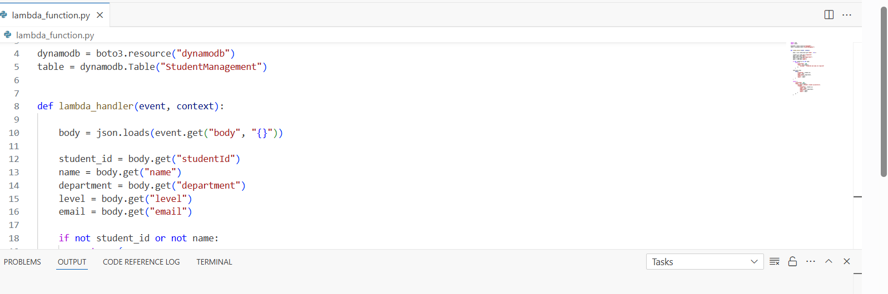

# Student Management API

A serverless Student Management API built using AWS Lambda, API Gateway, and DynamoDB.

## Project Overview

This project is a serverless REST API that allows student information to be submitted and stored in an Amazon DynamoDB database.

The API receives student data through Amazon API Gateway, processes the request using AWS Lambda, and stores the student record in DynamoDB.

## Technologies Used

* **AWS Lambda** — Handles the API logic
* **Amazon API Gateway** — Provides the HTTP API endpoint
* **Amazon DynamoDB** — Stores student information
* **Python** — Programming language used for the Lambda function
* **AWS CloudShell** — Used to test the API

## Architecture

Client → API Gateway → Lambda → DynamoDB

## API Endpoint

**Method:** `POST`

**Endpoint:**
`https://llvfbojpo7.execute-api.us-east-1.amazonaws.com/prod/students`

## Example Request

```json
{
  "studentId": "STU002",
  "name": "Aisha",
  "department": "Chemistry",
  "level": "400",
  "email": "aisha2@example.com"
}
```

## Example Response

```json
{
  "message": "Student created successfully",
  "student": {
    "studentId": "STU002",
    "name": "Aisha",
    "department": "Chemistry",
    "level": "400",
    "email": "aisha2@example.com"
  }
}
```

## How It Works

1. A client sends student information to the API.
2. Amazon API Gateway receives the request.
3. API Gateway invokes the AWS Lambda function.
4. Lambda processes the student information.
5. The student record is stored in DynamoDB.
6. The API returns a success response to the client.

## Project Status

The `POST /students` endpoint is currently working successfully.

Future improvements will include additional endpoints for retrieving, updating, and deleting student records.
## Screenshots

### AWS Lambda



### API Gateway


### DynamoDB


